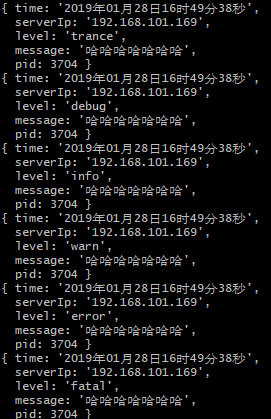

# node-logger-easy
Export the log to the console or file, customize the output log format, support sending mail to the designated mailbox;

[![NPM Version][npm-image]][npm-url]
[![NPM Downloads][downloads-image]][downloads-url]
[![Node.js Version][node-version-image]][node-version-url]

## description

If you want to see more:
	
	- 1. 'git clone git@github.com:dai1254473705/node-logger-easy.git';
	
	- 2. 'npm install'
	
	- 3. 'npm run test'

## Installation

```sh
`npm install node-logger-easy --save` 
or `cnpm install node-logger-easy --save` 
or `yarn add node-logger-easy`
```

## colors

> all colors :

+ 'black'
+ 'red'
+ 'green'
+ 'yellow'
+ 'blue'
+ 'magenta'
+ 'cyan'
+ 'white'
+ 'gray'
+ 'redBright'
+ 'greenBright'
+ 'yellowBright'
+ 'blueBright'
+ 'magentaBright'
+ 'cyanBright'
+ 'whiteBright'


## example

```sh
/**
 * test
 * index.js
 */
const nodeLoggerEasy = require('../index');
const logger = new nodeLoggerEasy({
    format: {
        datePattern: 'YYYYMMDDHHmmss',
        extension: 'log',// [log,txt]file extension
        type: 'jsonString', // string || json(no color) || jsonString 
        params: ['time','serverIp','level','message','pid'], //set default log params
        paramsTimeFormat: 'YYYY年MM月DD日HH时mm分ss秒',// logs time format,use moment.js ,for example[YYYYMMDDHHmmss,YYYY年MM月DD日HH时mm分ss秒]
        console: true, // if you want see the logs in terminal; default:true
    },
    // if you want to out put log to file
    file: {
        save: true, // is create log files,default:false 
        path: './logs/',// logs dir path,auto create dir
        saveLevel: ['error','warn'],//set the level you want to save,default: [] , all level: ['trance', 'debug', 'info', 'warn', 'error', 'fatal']
        saveDay: 7,// save days,if '0',will not delete;default : 0
    },
    // set color if you like 
    // ['black','red','green','yellow','blue','magenta','cyan','white','gray','redBright','greenBright','yellowBright','blueBright','magentaBright','cyanBright','whiteBright']
    color: {
        trance: 'yellow',
        debug: 'blue',
        info: 'cyan',
        warn: 'white',
        error: 'gray',
        fatal: 'redBright'
    },
    // you should set false or not set on production env;
    debug: true // some logs
});
module.exports = logger;
```

### use

```sh
logger.trance('哈哈哈哈哈哈哈',{color: 'blue'});
logger.debug('哈哈哈哈哈哈哈',{color: 'redBright'});
logger.info('哈哈哈哈哈哈哈');
logger.warn('哈哈哈哈哈哈哈');
logger.error('哈哈哈哈哈哈哈');
logger.fatal('哈哈哈哈哈哈哈');
logger.warn({haha: 213,asdf: 'sdf'},{color: 'blue',json: true});
```

+ jsonString format


+ json format



+ string format


+ logs file 


### method 

> logger\[level](message,options);

+ messages:

	---logger.info(String);
	
	---logger.info(String,options);
	
	---logger.info(Object);
	
	---logger.info(Object,options);

+ options

> {color: 'blue'}

You can specify the log color of the current output，Only show color in terminal；

> all levels: ['trance', 'debug', 'info', 'warn', 'error', 'fatal']

+ logger.trance
+ logger.debug
+ logger.info
+ logger.warn
+ logger.error
+ logger.fatal

### attention
email Not completed, ongoing updates

## License

[MIT](LICENSE)

Copyright (c) 2018-present, Yunzhou Dai

[npm-image]: https://img.shields.io/npm/v/node-logger-easy.svg
[npm-url]: https://npmjs.org/package/node-logger-easy
[node-version-url]: https://nodejs.org/en/download/
[node-version-image]: https://img.shields.io/node/v/node-logger-easy.svg
[downloads-image]: https://img.shields.io/npm/dm/node-logger-easy.svg
[downloads-url]: https://npmjs.org/package/node-logger-easy